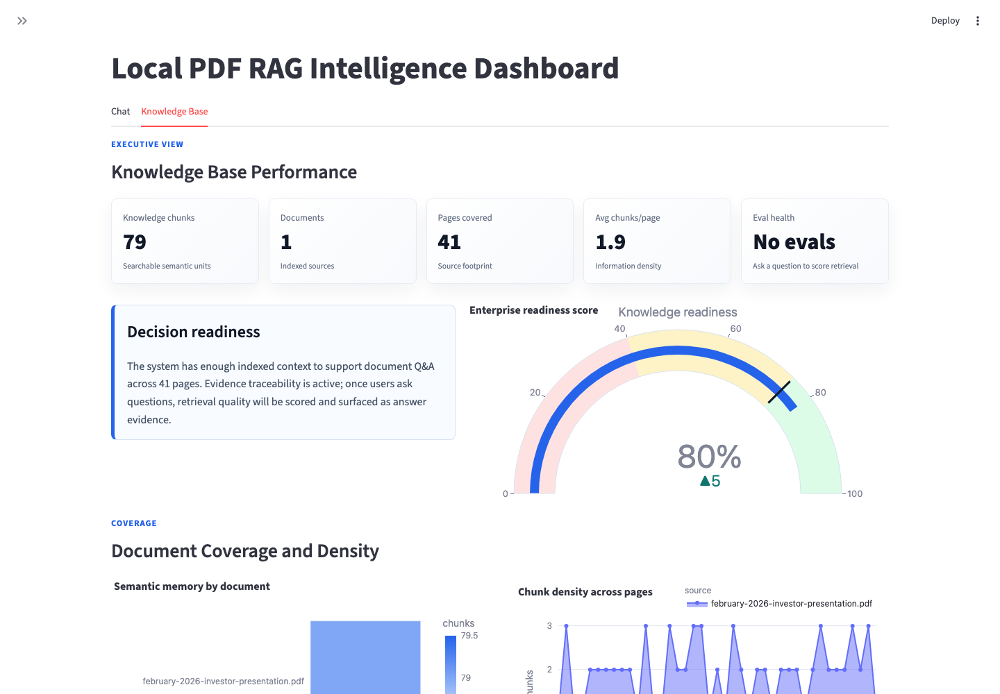
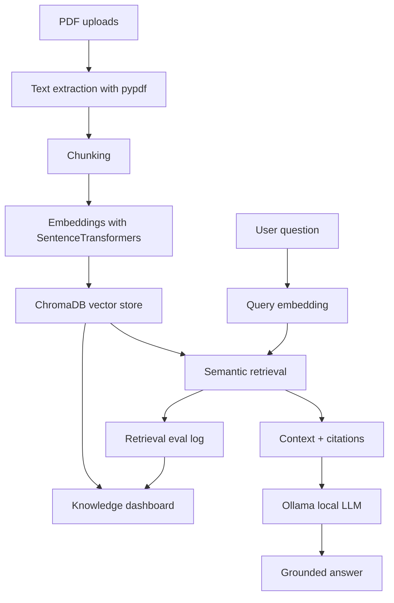

# Local PDF RAG Intelligence Dashboard

A local-first Streamlit application for asking questions over PDFs with retrieval augmented generation, interactive analytics, and built-in answer quality tracking.

The project turns uploaded PDFs into a searchable knowledge base, retrieves relevant chunks with embeddings, and answers through an Ollama-hosted local model. It is designed as a practical AI systems lab: private inference, transparent retrieval, citations, and lightweight evaluation in one browser app.



## Why I Built This

Most AI demos stop at a prompt box. This project explores the larger system around the model: document ingestion, vector memory, retrieval, local inference, citations, and evaluation. The goal is to make the assistant inspectable enough that a user can see what knowledge is indexed, which pages influence answers, and how retrieval quality changes over time.

## Features

- Multi-PDF upload and indexing
- Semantic search with SentenceTransformers embeddings
- BGE embedding model support for stronger retrieval quality
- Persistent ChromaDB vector store
- Ollama-backed local LLM answers
- Source references for retrieved PDF chunks
- Interactive Plotly dashboard views
- Internal evaluation log for answer quality tracking
- Model and embedding controls from the Streamlit UI

## Architecture



## Example Use Case

Upload an investor deck, policy document, technical manual, or research PDF. The app indexes the document into semantic chunks, lets you ask grounded questions, and shows the operational picture behind the answers: coverage, page density, retrieval evidence, and evaluation health.

## Tech Stack

- Python
- Streamlit
- ChromaDB
- SentenceTransformers
- BAAI BGE embeddings
- Ollama
- pypdf
- Plotly
- pandas

## Run Locally

Create and activate a Python environment:

```bash
python -m venv .venv
source .venv/bin/activate
```

Install dependencies:

```bash
pip install -r requirements.txt
```

Pull a local Ollama model:

```bash
ollama pull llama3.1:8b
```

Start the app:

```bash
streamlit run app.py
```

If `streamlit` is not found, run:

```bash
python -m streamlit run app.py
```

## Workflow

1. Start the Streamlit app.
2. Upload one or more PDFs in the sidebar.
3. Choose the embedding model and Ollama model.
4. Click **Index PDFs**.
5. Ask questions against the document knowledge base.
6. Review citations, dashboard metrics, and evaluation history.

## Portfolio Notes

This project demonstrates the core building blocks of a local enterprise AI assistant:

- Private local model inference
- Retrieval augmented generation
- Vector memory
- Document ingestion
- Evaluation logging
- Visual operational dashboarding

## What This Shows

- How a PDF becomes a searchable vector knowledge base
- How local models can answer without sending documents to a hosted API
- How citations and retrieval scores improve trust
- How dashboarding makes an AI workflow easier to operate
- How internal evals can be introduced early instead of bolted on later

## Roadmap

- Add automated retrieval evaluation tests
- Add exportable evaluation reports
- Add user-managed collections
- Add LangGraph orchestration for ingestion and retrieval steps
